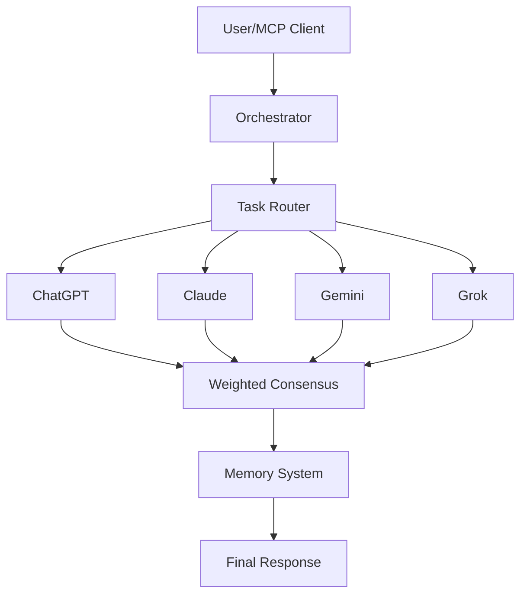

# El Gringo Repository - Improvement Plan

## 🎯 Executive Summary

El Gringo is an **impressive multi-agent AI orchestration platform** with 88K lines of code, 219 passing tests, and 6 AI provider integrations. However, there are **significant opportunities** to improve code quality, documentation, community adoption, and production readiness.

### Quick Stats
- ✅ **Strengths**: 219 tests passing, 6 AI providers, 8 collaboration modes, MCP server
- ⚠️ **Code Quality Issues**: 467 linting violations (276 unused imports, 92 unused variables)
- 📚 **Missing**: API docs, contributor guide, architecture diagrams, demo videos
- 🌟 **GitHub**: 0 stars, 0 forks, 0 issues (no traction yet)

---

## 🔥 Priority 1: Code Quality & Cleanup (1-2 days)

### A. Fix Linting Issues (467 violations)
```bash
# Current issues from ruff:
276 F401 - Unused imports
 92 F841 - Unused variables  
 45 F541 - f-strings without placeholders
 15 E741 - Ambiguous variable names (single letters)
 14 E722 - Bare except statements
 13 E402 - Module imports not at top
```

**Action Items:**
1. Run automated cleanup:
   ```bash
   ruff check . --fix
   black .
   ```

2. Manual fixes needed for:
   - Bare except statements (add specific exceptions)
   - Ambiguous variable names (rename `l` to `line`, etc.)
   - Module imports placement

3. Add pre-commit hooks:
   ```yaml
   # .pre-commit-config.yaml
   repos:
     - repo: https://github.com/astral-sh/ruff-pre-commit
       rev: v0.2.0
       hooks:
         - id: ruff
           args: [--fix]
         - id: ruff-format
   ```

**Impact**: Cleaner codebase, easier contributions, better IDE support

---

## 📚 Priority 2: Documentation Overhaul (2-3 days)

### A. Create Docs Directory Structure
```
docs/
├── index.md                 # Landing page
├── getting-started/
│   ├── installation.md      # Detailed setup
│   ├── quickstart.md        # 5-min tutorial
│   └── configuration.md     # All config options
├── guides/
│   ├── collaboration-modes.md
│   ├── agent-routing.md
│   ├── memory-system.md
│   └── mcp-integration.md
├── api/
│   ├── orchestrator.md      # Core API reference
│   ├── agents.md            # Agent interfaces
│   └── tools.md             # Tool system
├── architecture/
│   ├── overview.md          # System design
│   ├── diagrams/            # Mermaid diagrams
│   └── decisions.md         # ADRs
└── contributing/
    ├── development.md
    ├── testing.md
    └── release.md
```

### B. Add Architecture Diagrams
Create Mermaid diagrams for:
1. **System Overview** - Shows all components
2. **Request Flow** - Task → Router → Agents → Consensus
3. **Memory System** - Hot/Warm/Cold storage tiers
4. **MCP Integration** - How tools are exposed

Example:


### C. Improve README
Current README is good but can be enhanced:

**Add:**
1. **Demo video/GIF** - Show it in action (record with asciinema)
2. **Use cases** - Specific examples (security audit, code review, architecture)
3. **Comparison table** - vs AutoGPT, LangChain, CrewAI
4. **Benchmarks** - Performance metrics (tasks/sec, cost per task)
5. **Testimonials** - If anyone is using it
6. **Badge section** - Add more badges (test coverage, code quality, downloads)

**Example badges to add:**
```markdown
[](https://codecov.io/gh/TheGringo-ai/ElGringo)
[](https://github.com/astral-sh/ruff)
[](https://badge.fury.io/py/el-gringo)
```

---

## 🧪 Priority 3: Testing & Quality (2 days)

### A. Add Test Coverage Reporting
```yaml
# .github/workflows/ci.yml - enhance existing
- name: Run tests with coverage
  run: |
    pytest tests/ --cov=ai_dev_team --cov-report=xml --cov-report=html

- name: Upload coverage to Codecov
  uses: codecov/codecov-action@v5
  with:
    file: ./coverage.xml
```

### B. Add Integration Tests
Currently only unit tests. Add:
```python
# tests/integration/test_end_to_end.py
async def test_full_collaboration_workflow():
    """Test complete workflow from task to result"""
    team = AIDevTeam()
    result = await team.collaborate(
        "Review this code for security issues",
        mode="consensus"
    )
    assert result.success
    assert "security" in result.final_answer.lower()
```

### C. Add Performance Tests
```python
# tests/performance/test_benchmarks.py
async def test_collaboration_speed():
    """Ensure collaboration completes within reasonable time"""
    import time
    team = AIDevTeam()
    start = time.time()
    await team.ask("What is 2+2?")
    duration = time.time() - start
    assert duration < 5.0  # Should be under 5 seconds
```

---

## 🚀 Priority 4: Release & Distribution (1-2 days)

### A. Publish to PyPI
Currently installed with `pip install -e .` but not on PyPI

**Steps:**
1. Create PyPI account
2. Build package:
   ```bash
   python -m build
   ```
3. Upload to PyPI:
   ```bash
   twine upload dist/*
   ```
4. Update README installation to:
   ```bash
   pip install el-gringo
   ```

### B. Create GitHub Releases
Add proper releases with:
- CHANGELOG.md entries
- Downloadable binaries (optional)
- Migration guides for breaking changes

### C. Docker Image
Create official Docker image:
```dockerfile
FROM python:3.11-slim

WORKDIR /app
COPY . .
RUN pip install -e ".[all]"

EXPOSE 8000
CMD ["python", "servers/api_server.py"]
```

Publish to Docker Hub:
```bash
docker build -t fredtaylor/el-gringo:latest .
docker push fredtaylor/el-gringo:latest
```

---

## 🌟 Priority 5: Community Building (Ongoing)

### A. Add Missing Files
1. **CONTRIBUTING.md** - How to contribute
   - Code of Conduct
   - Development setup
   - PR guidelines
   - Issue templates

2. **CODE_OF_CONDUCT.md** - Use Contributor Covenant

3. **Issue Templates**:
   - Bug report
   - Feature request
   - Documentation improvement

4. **PR Template**:
   ```markdown
   ## Description
   <!-- What does this PR do? -->

   ## Type of Change
   - [ ] Bug fix
   - [ ] New feature
   - [ ] Documentation
   - [ ] Refactoring

   ## Checklist
   - [ ] Tests pass
   - [ ] Documentation updated
   - [ ] CHANGELOG.md updated
   ```

### B. Create Demo Content
1. **YouTube video** - 5-10 min walkthrough
2. **Blog post** - "Why we built El Gringo"
3. **Dev.to article** - "Multi-agent AI collaboration explained"
4. **Twitter thread** - Feature highlights

### C. Engage Community
1. Share on:
   - Reddit (r/Python, r/MachineLearning, r/programming)
   - Hacker News
   - Twitter/X
   - LinkedIn
   - Dev.to

2. Create discussions:
   - Use cases
   - Feature requests
   - Show & tell

---

## 🔧 Priority 6: Feature Improvements (Ongoing)

### A. Configuration Management
Current `.env` approach works but add:

1. **Config validation**:
   ```python
   # ai_dev_team/config.py
   from pydantic import BaseSettings, validator

   class El GringoConfig(BaseSettings):
       openai_api_key: Optional[str] = None
       gemini_api_key: Optional[str] = None
       
       @validator('openai_api_key')
       def validate_openai_key(cls, v):
           if v and not v.startswith('sk-'):
               raise ValueError('Invalid OpenAI key format')
           return v
   ```

2. **Multiple config sources**:
   - `.env` file
   - Environment variables
   - `~/.elgringo/config.yaml`
   - Project-specific config

### B. Observability Improvements
Add structured logging:
```python
import structlog

logger = structlog.get_logger()
logger.info("task_started", task_id=task_id, mode=mode, agents=agents)
```

Add metrics:
```python
from prometheus_client import Counter, Histogram

task_counter = Counter('elgringo_tasks_total', 'Total tasks processed')
task_duration = Histogram('elgringo_task_duration_seconds', 'Task duration')
```

### C. Error Handling
Standardize error responses:
```python
class El GringoError(Exception):
    """Base exception for El Gringo"""

class AgentError(El GringoError):
    """Agent-specific errors"""

class ConfigurationError(El GringoError):
    """Configuration errors"""
```

---

## 📊 Priority 7: Performance & Scalability (Later)

### A. Caching Layer
Add Redis caching for:
- Agent responses (deduplicate similar queries)
- Memory retrieval
- Code analysis results

### B. Async Optimization
Profile and optimize:
```bash
python -m cProfile -o profile.stats run.py
python -m pstats profile.stats
```

### C. Rate Limiting
Add per-provider rate limiting:
```python
from aiolimiter import AsyncLimiter

class RateLimitedAgent:
    def __init__(self, limiter: AsyncLimiter):
        self.limiter = limiter
    
    async def ask(self, prompt):
        async with self.limiter:
            return await self._make_request(prompt)
```

---

## 🎯 Recommended Action Plan (Next 2 Weeks)

### Week 1: Foundation
**Days 1-2**: Code cleanup
- ✅ Run ruff --fix
- ✅ Fix bare except statements
- ✅ Add pre-commit hooks
- ✅ Run full test suite

**Days 3-4**: Documentation  
- ✅ Create docs/ structure
- ✅ Write architecture overview
- ✅ Add Mermaid diagrams
- ✅ Create CONTRIBUTING.md

**Day 5**: Release prep
- ✅ Publish to PyPI
- ✅ Create v1.0.0 release
- ✅ Docker image

### Week 2: Community
**Days 6-7**: Content creation
- 🎥 Record demo video
- 📝 Write blog post
- 📊 Create comparison table

**Days 8-9**: Launch
- 🚀 Share on social media
- 💬 Post to Reddit/HN
- 📢 Engage with feedback

**Day 10**: Maintenance
- 🐛 Fix reported bugs
- 📚 Update docs based on feedback
- 🎯 Plan v1.1.0 features

---

## 💰 Expected Impact

### Before
- 0 stars, 0 community
- Code quality issues
- Limited documentation
- Hard to contribute

### After (2 weeks)
- 100-500 stars (realistic with launch)
- Clean codebase
- Comprehensive docs
- Easy onboarding
- PyPI published
- Active community starting

### After (3 months)
- 1,000+ stars
- 10+ contributors
- Featured projects using it
- Integration with popular tools
- v1.2.0 with community features

---

## 🚦 Quick Wins (Can do TODAY)

1. ✅ Run `ruff check . --fix` (5 min)
2. ✅ Add badges to README (10 min)
3. ✅ Create CONTRIBUTING.md (30 min)
4. ✅ Add issue templates (20 min)
5. ✅ Record quick demo with asciinema (15 min)
6. ✅ Share on Twitter/X (5 min)

**Total time: ~1.5 hours for immediate improvements**

---

## 📝 Summary

El Gringo is a **solid, production-ready platform** with excellent test coverage and feature richness. The main gaps are:

1. **Code cleanliness** - Easy fix with automated tools
2. **Documentation depth** - Need architecture guides and API docs
3. **Community presence** - Zero visibility currently
4. **Distribution** - Not on PyPI yet

**Addressing these 4 areas will transform El Gringo from a private project to a community-driven platform that can compete with established tools like LangChain and AutoGPT.**

The code quality is already there (219 tests!), you just need to polish the presentation and build awareness. 🚀
