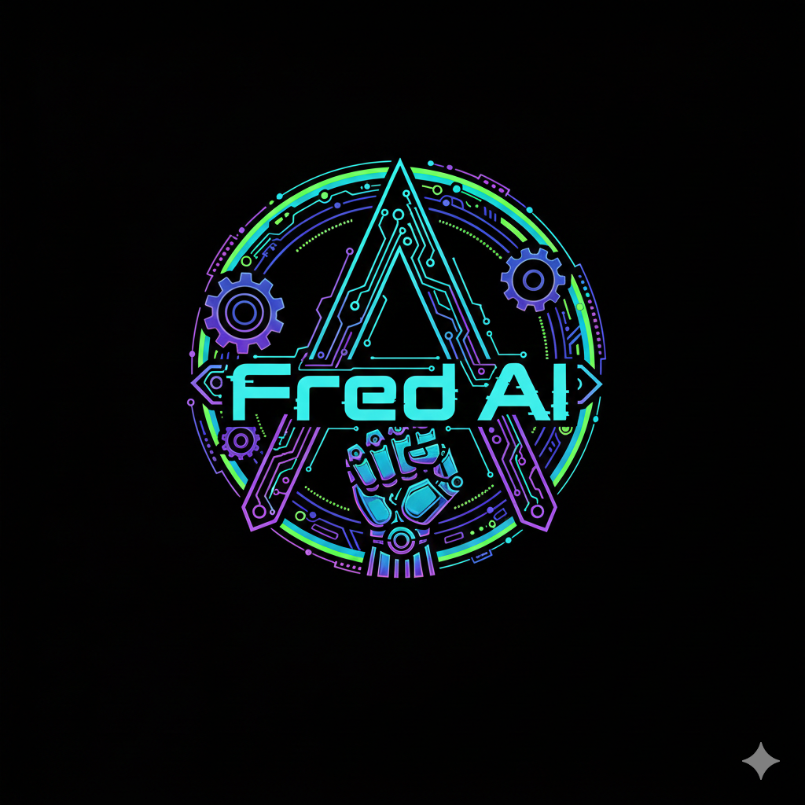

<p align="center">
  
</p>

<h1 align="center">FredAI</h1>

<p align="center">
  <a href="https://github.com/TheGringo-ai/FredAI/actions/workflows/ci.yml"></a>
  <a href="LICENSE"></a>
  <a href="https://www.python.org/downloads/"></a>
</p>

<p align="center"><strong>Multi-agent AI orchestration platform that makes your AI models work as a team.</strong></p>

FredAI connects ChatGPT, Gemini, Grok, Claude, Ollama, and LlamaCloud into a single intelligent workforce. Instead of chatting with one model at a time, FredAI routes tasks to the right model, runs them in parallel, synthesizes their responses, learns from every interaction, and never repeats mistakes.

Think of it as the operating system layer between AI models and real-world work.

### Try it in 30 seconds (just Ollama, no API keys)

```bash
git clone https://github.com/TheGringo-ai/FredAI.git && cd FredAI
pip install -e .
ollama pull llama3.2:3b
python demo.py
```

---

## What It Does

```
You: "Review this auth system for security issues"

FredAI:
  -> Routes to SecurityAuditor + Grok Reasoner + ChatGPT (parallel)
  -> Each agent analyzes independently
  -> Weighted consensus synthesizes findings
  -> Memory system stores the solution pattern
  -> Next time a similar task appears, it's faster and smarter
```

## Architecture

```
                        +------------------+
                        |    FredAI CLI    |
                        |   MCP Server     |
                        |   REST API       |
                        |   Gradio UI      |
                        +--------+---------+
                                 |
                    +------------+------------+
                    |      Orchestrator       |
                    |  (8 collaboration modes)|
                    +--+-----+-----+-----+---+
                       |     |     |     |
              +--------+  +--+--+ +--+--+ +--------+
              |ChatGPT |  |Gemini| |Grok | |Ollama  |
              |  GPT-4 |  | 2.5  | |x2   | |Local   |
              +--------+  +------+ +-----+ +--------+
                    |         |        |         |
                    +----+----+--------+---------+
                         |
                  +------+------+
                  |   Memory    |
                  | System      |
                  | (Firestore  |
                  |  + Local)   |
                  +------+------+
                         |
              +----------+----------+
              |    Code RAG         |
              | (Solution Patterns) |
              +---------------------+
```

## Key Features

### Multi-Agent Collaboration
- **8 modes**: parallel, sequential, consensus, debate, peer review, brainstorming, devil's advocate, expert panel
- **Intelligent routing**: tasks go to the best model based on type, complexity, and cost
- **Weighted synthesis**: responses are merged using confidence scores, not just concatenated

### Multi-Turn Sessions
- **Conversation continuity**: agents remember what was discussed across calls using session IDs
- **Auto-summarization**: long sessions get compressed so agents stay focused
- **Persistent**: sessions survive restarts, stored on disk

### Custom Personas
- Define your own specialist agents with custom system prompts and behavior
- Backed by any provider (ChatGPT, Gemini, Grok, Ollama)
- Auto-register on startup — create once, use everywhere

### GitHub PR Review
- `ai_team_review_pr 123` — multi-agent PR review with structured output
- Agents analyze from security, performance, and architecture angles
- Returns severity-ranked findings with fix suggestions

### Intelligence Reports
- Every collaborate() call shows what's happening behind the scenes
- Routing decisions, memory injections, agent perspectives, cost breakdown
- Agreement/disagreement detection between agents

### Smart Memory
- Every interaction is captured, scored, and searchable via TF-IDF
- **Tiered storage**: hot (recent) / warm (proven valuable) / cold (compressed)
- **Consolidation engine**: auto-deduplicates solutions, prunes trivial entries, compresses old data
- **Mistake prevention**: past failures are injected into prompts before they happen again
- **Auto-injection**: stored solution patterns and project conventions are automatically injected into every collaborate call — the team learns your codebase's rules and follows them
- **Quality feedback loop**: rate outcomes (thumbs up/down), patterns gain or lose quality score, low-quality patterns auto-decay and prune
- **Project-scoped memory**: pass `project: "my-app"` to pull only relevant patterns for that project
- Dual persistence: local JSON + optional Firestore for cross-session memory

### Code RAG
- Index any codebase for retrieval-augmented generation
- Past solutions from memory are automatically included in context
- Pattern detection for auth, API, database, and more

### FredFix Security Scanner
- Scans entire codebases for security vulnerabilities, bugs, and performance issues
- Categorizes findings by severity (critical, high, medium, low)
- Auto-fix mode applies safe patches with rollback support
- Stores findings in memory to prevent reintroduction

### Specialist Agents
- **SecurityAuditor** - OWASP/CWE pattern scanning, secret detection
- **CodeReviewer** - complexity analysis, style checking, issue categorization
- **SolutionArchitect** - ADR generation, architecture pattern detection

### Apple Silicon Optimization
- Smart routing between local MLX models and cloud APIs
- GPU memory detection for optimal model selection
- Core ML integration for on-device inference

### MCP Server (28 tools)
Works directly with Claude Code, Cursor, or any MCP-compatible client:

| Tool | What it does |
|------|-------------|
| `ai_team_collaborate` | Full multi-agent collaboration (auto-injects memory patterns) |
| `ai_team_ask` | Quick single-agent question |
| `ai_team_review` | Multi-agent code review |
| `ai_team_security_audit` | Security vulnerability scan |
| `ai_team_architect` | Architecture design |
| `ai_team_brainstorm` | Creative ideation |
| `ai_team_debug` | Multi-perspective debugging |
| `fredfix_scan` | Scan project for issues |
| `fredfix_auto_fix` | Auto-fix detected issues |
| `memory_search` | Search past interactions |
| `memory_store_mistake` | Record a mistake pattern |
| `memory_store_solution` | Record a solution pattern |
| `memory_curate` | Deduplicate and clean memory entries |
| `ai_team_teach` | Teach the team new knowledge |
| `ai_team_insights` | Get learning analytics |
| `ai_team_prompts` | Browse prompt templates |
| `ai_team_status` | Team health, stats, and live cost data |
| `ai_team_costs` | Detailed cost reports (daily/weekly/monthly/per-model) |
| `ai_team_benchmark` | Compare agents on standardized prompts, build routing table |
| `ai_team_routing_table` | Show which agent is best for which task type |
| `ai_team_rate` | Rate a collaboration outcome (thumbs up/down), triggers quality decay + prune |
| `ai_team_quality_report` | Memory quality report — scores, top patterns, pruning stats |
| `ai_team_sessions` | List, view, or delete multi-turn conversation sessions |
| `ai_team_review_pr` | Multi-agent GitHub PR review (security, performance, architecture) |
| `ai_team_create_persona` | Create custom agent personas with specialized knowledge |
| `load_project_context` | Load project files and conventions for context-aware generation |
| `verify_code` | Run syntax checks and build verification |

## Quick Start

### Prerequisites
- Python 3.9+
- At least one API key (OpenAI, Google, xAI, or Ollama running locally)

### Install

```bash
git clone https://github.com/TheGringo-ai/FredAI.git
cd FredAI
pip install -e .
```

### Configure

```bash
cp .env.template .env
# Add your API keys:
#   OPENAI_API_KEY=sk-...
#   GEMINI_API_KEY=...
#   XAI_API_KEY=xai-...
```

For local models (no API keys needed):
```bash
# Install Ollama: https://ollama.com
ollama pull llama3.2:3b
```

### Run

```bash
# Interactive CLI
fred

# Quick demo (no API keys, just Ollama)
python demo.py

# MCP Server (for Claude Code / Cursor)
python servers/mcp_server.py

# REST API
python servers/api_server.py

# Gradio UI
fred-studio
```

### MCP Integration

Add to your `.mcp.json`:
```json
{
  "mcpServers": {
    "fred-ai": {
      "command": "python3",
      "args": ["path/to/FredAI/servers/mcp_server.py"],
      "env": {
        "PYTHONPATH": "path/to/FredAI",
        "OPENAI_API_KEY": "sk-...",
        "XAI_API_KEY": "xai-..."
      }
    }
  }
}
```

## Project Structure

```
FredAI/
  ai_dev_team/
    agents/          # ChatGPT, Gemini, Grok, Claude, Ollama, LlamaCloud, Specialists
    collaboration/   # Multi-agent engine, weighted consensus, streaming
    memory/          # Tiered memory system, learning engine, mistake prevention
    intelligence/    # Code RAG, embeddings, semantic analysis
    routing/         # Task classification, cost optimization, performance tracking
    autonomous/      # Self-correction, task decomposition, session learning
    apple/           # Apple Silicon routing, MLX inference, Core ML
    knowledge/       # Domain knowledge bases, auto-learner, teaching system
    tools/           # File, git, docker, deploy, database, browser tools
    cli.py           # Interactive REPL
    orchestrator.py  # Core orchestration engine (2,400+ lines)
    sessions.py      # Multi-turn conversation sessions with persistence
    personas.py      # Custom agent personas — user-defined specialists
    dashboard_ui.py  # Gradio web dashboard (costs, quality, agents, routing)
  servers/
    mcp_server.py    # MCP protocol server (28 tools)
    api_server.py    # REST API
  tests/             # 219 tests, all passing
```

## Stats

- **69,000+** lines of Python across **149** modules
- **6** AI providers supported (ChatGPT, Gemini 2.5 Flash, Grok, Claude, Ollama, LlamaCloud)
- **8** collaboration modes
- **28** MCP tools (sessions, PR review, personas, intelligence reports, cost tracking, benchmarking)
- **3** specialist agents
- **219** tests passing
- **19** domain knowledge bases
- **150+** solution patterns in memory (and growing)

## How It Compares

FredAI is in the same category as [OpenClaw](https://github.com/openclaw/openclaw) - the AI agent orchestration layer. The thesis is the same: **a well-orchestrated team of models with real-world tool access outperforms any single model in a chat box.**

Key differences:
- Multi-agent consensus and debate (not just single-model routing)
- Built-in memory that learns and consolidates across sessions
- Specialist agents for security, architecture, and code review
- Apple Silicon optimization for local inference
- Cost-aware routing (budget/standard/premium tiers)

## What This Is NOT

- **Not a wrapper around one model** — FredAI orchestrates multiple models, it doesn't just proxy requests to ChatGPT
- **Not a chatbot** — it's a tool execution platform. Agents take actions, not just generate text
- **Not autonomous by default** — tool calls require approval through the MCP client. Nothing runs without your consent
- **Not a hosted service** — everything runs on your machine. Your code and API keys never leave your environment
- **Not a LangChain competitor** — LangChain is a composable framework for building chains. FredAI is a ready-to-run platform with opinionated defaults. You configure it, not compose it

## Security

See [SECURITY.md](SECURITY.md) for the full security model, tool permissions, and vulnerability reporting.

## License

Apache 2.0 - see [LICENSE](LICENSE)

Copyright 2024-2026 Fred Taylor
